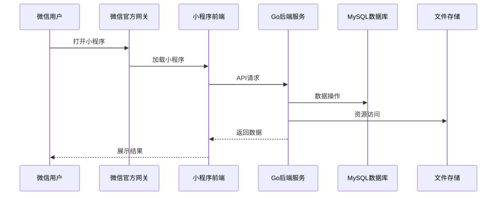

# 个性化营养膳食智能规划系统开发文档

## 1. 项目概述

### 1.1 项目背景
随着人们健康意识的提高，个性化营养膳食规划成为越来越多人的需求。本系统旨在为用户提供个性化的营养膳食智能规划服务，帮助用户根据自身健康状况和饮食目标制定合理的膳食计划。

### 1.2 项目目标
- 为普通用户提供个人健康数据管理、营养摄入监测、膳食计划执行等功能
- 为规划师提供专业膳食指导、健康教育内容发布等功能
- 为系统管理员提供用户管理、内容审核等功能
- 实现智能膳食推荐，根据用户健康数据和饮食目标生成个性化膳食方案

### 1.3 系统功能模块
- 账号管理
- 个人信息与健康数据管理
- 营养摄入监测与反馈
- 膳食计划管理
- 食材管理
- 智能膳食推荐
- 健康教育管理
- 统计数据管理
- 意见与反馈管理

## 2. 技术架构

### 2.1 前端架构
- **框架**：微信小程序原生框架
- **UI组件**：微信小程序原生组件 + 自定义组件
- **状态管理**：微信小程序内置状态管理
- **网络请求**：微信小程序API

### 2.2 后端架构
- **语言**：Go 1.20+
- **框架**：Gin
- **数据库**：MySQL 8.0+
- **缓存**：Redis (可选)
- **认证**：JWT

### 2.3 系统架构图



## 3. 数据库设计

### 3.1 数据库表结构

#### 3.1.1 用户表（user）
| 字段名 | 数据类型 | 约束 | 描述 |
| :--- | :--- | :--- | :--- |
| user_id | VARCHAR(20) | PRIMARY KEY | 用户ID |
| username | VARCHAR(50) | NOT NULL | 用户名 |
| password | VARCHAR(100) | NOT NULL | 登录密码 |
| phone | VARCHAR(20) | NOT NULL | 手机号码 |
| gender | VARCHAR(10) | NOT NULL | 性别 |
| age | INT | NOT NULL | 年龄 |
| email | VARCHAR(100) | NOT NULL | 邮箱 |
| role_type | VARCHAR(20) | NOT NULL | 角色类型 |
| created_at | DATETIME | NOT NULL | 账号创建时间 |
| updated_at | DATETIME | NOT NULL | 最后更新时间 |

#### 3.1.2 规划师表（dietitian）
| 字段名 | 数据类型 | 约束 | 描述 |
| :--- | :--- | :--- | :--- |
| dietitian_id | VARCHAR(20) | PRIMARY KEY | 规划师ID |
| name | VARCHAR(50) | NOT NULL | 姓名 |
| password | VARCHAR(100) | NOT NULL | 登录密码 |
| title | VARCHAR(50) | NOT NULL | 职称 |
| specialty | VARCHAR(100) | NOT NULL | 专业领域 |
| contact | VARCHAR(100) | NOT NULL | 联系方式 |
| created_at | DATETIME | NOT NULL | 账号创建时间 |
| updated_at | DATETIME | NOT NULL | 最后更新时间 |
| status | VARCHAR(20) | NOT NULL | 启用状态 |

#### 3.1.3 健康数据表（health_data）
| 字段名 | 数据类型 | 约束 | 描述 |
| :--- | :--- | :--- | :--- |
| data_id | VARCHAR(20) | PRIMARY KEY | 数据ID |
| user_id | VARCHAR(20) | FOREIGN KEY | 用户ID |
| height | DECIMAL(5,2) | NOT NULL | 身高 |
| weight | DECIMAL(5,2) | NOT NULL | 体重 |
| blood_pressure | VARCHAR(20) | NOT NULL | 血压值 |
| blood_sugar | DECIMAL(5,2) | NOT NULL | 血糖值 |
| heart_rate | INT | NOT NULL | 心率 |
| allergy_history | TEXT | NOT NULL | 过敏病史 |
| recorded_at | DATETIME | NOT NULL | 数据录入时间 |

#### 3.1.4 营养记录表（nutrition_record）
| 字段名 | 数据类型 | 约束 | 描述 |
| :--- | :--- | :--- | :--- |
| record_id | VARCHAR(20) | PRIMARY KEY | 记录ID |
| user_id | VARCHAR(20) | FOREIGN KEY | 用户ID |
| intake_date | DATE | NOT NULL | 摄入日期 |
| intake_time | VARCHAR(20) | NOT NULL | 摄入时间段 |
| food_name | VARCHAR(100) | NOT NULL | 食物名称 |
| calories | DECIMAL(6,2) | NOT NULL | 摄入热量 |
| protein | DECIMAL(6,2) | NOT NULL | 蛋白质 |
| carbohydrate | DECIMAL(6,2) | NOT NULL | 碳水化合物 |
| fat | DECIMAL(6,2) | NOT NULL | 脂肪 |
| fiber | DECIMAL(6,2) | NOT NULL | 纤维素 |
| recorded_at | DATETIME | NOT NULL | 记录录入时间 |

#### 3.1.5 膳食计划表（diet_plan）
| 字段名 | 数据类型 | 约束 | 描述 |
| :--- | :--- | :--- | :--- |
| plan_id | VARCHAR(20) | PRIMARY KEY | 计划ID |
| user_id | VARCHAR(20) | FOREIGN KEY | 用户ID |
| dietitian_id | VARCHAR(20) | FOREIGN KEY | 规划师ID |
| plan_title | VARCHAR(100) | NOT NULL | 计划标题 |
| diet_goal | VARCHAR(50) | NOT NULL | 饮食目标 |
| plan_content | TEXT | NOT NULL | 计划内容详情 |
| audit_status | VARCHAR(20) | NOT NULL | 审核状态 |
| published_at | DATETIME | NOT NULL | 发布时间 |
| updated_at | DATETIME | NOT NULL | 最近更新时间 |

#### 3.1.6 食材表（ingredient）
| 字段名 | 数据类型 | 约束 | 描述 |
| :--- | :--- | :--- | :--- |
| ingredient_id | VARCHAR(20) | PRIMARY KEY | 食材ID |
| ingredient_name | VARCHAR(100) | NOT NULL | 食材名称 |
| category | VARCHAR(50) | NOT NULL | 食材类别 |
| nutrition_detail | TEXT | NOT NULL | 营养成分详情 |
| unit | VARCHAR(20) | NOT NULL | 计量单位 |
| calories_per_100g | DECIMAL(6,2) | NOT NULL | 每100克热量 |
| status | VARCHAR(20) | NOT NULL | 启用状态 |

#### 3.1.7 计划食材关联表（plan_ingredient_rel）
| 字段名 | 数据类型 | 约束 | 描述 |
| :--- | :--- | :--- | :--- |
| rel_id | VARCHAR(20) | PRIMARY KEY | 关联ID |
| plan_id | VARCHAR(20) | FOREIGN KEY | 计划ID |
| ingredient_id | VARCHAR(20) | FOREIGN KEY | 食材ID |

#### 3.1.8 健康教育表（health_edu）
| 字段名 | 数据类型 | 约束 | 描述 |
| :--- | :--- | :--- | :--- |
| content_id | VARCHAR(20) | PRIMARY KEY | 内容ID |
| dietitian_id | VARCHAR(20) | FOREIGN KEY | 规划师ID |
| article_title | VARCHAR(100) | NOT NULL | 文章标题 |
| health_category | VARCHAR(50) | NOT NULL | 健康分类 |
| content_detail | TEXT | NOT NULL | 图文内容详情 |
| audit_status | VARCHAR(20) | NOT NULL | 审核状态 |
| published_at | DATETIME | NOT NULL | 发布时间 |
| updated_at | DATETIME | NOT NULL | 最近更新时间 |

#### 3.1.9 意见反馈表（feedback）
| 字段名 | 数据类型 | 约束 | 描述 |
| :--- | :--- | :--- | :--- |
| feedback_id | VARCHAR(20) | PRIMARY KEY | 反馈ID |
| user_id | VARCHAR(20) | FOREIGN KEY | 用户ID |
| dietitian_id | VARCHAR(20) | FOREIGN KEY | 规划师ID |
| feedback_title | VARCHAR(100) | NOT NULL | 反馈标题 |
| feedback_content | TEXT | NOT NULL | 反馈内容 |
| feedback_type | VARCHAR(50) | NOT NULL | 反馈类型 |
| handle_status | VARCHAR(20) | NOT NULL | 处理状态 |
| feedback_time | DATETIME | NOT NULL | 反馈时间 |
| reply_content | TEXT | NULL | 回复内容 |
| replied_at | DATETIME | NULL | 回复时间 |

## 4. 后端API设计

### 4.1 账号管理

#### 4.1.1 用户注册
- **接口地址**：`/api/auth/register`
- **请求方法**：POST
- **请求参数**：
  - username: 用户名
  - password: 密码
  - phone: 手机号码
  - gender: 性别
  - age: 年龄
  - email: 邮箱
- **返回结果**：
  - code: 状态码
  - message: 消息
  - data: 用户信息

#### 4.1.2 用户登录
- **接口地址**：`/api/auth/login`
- **请求方法**：POST
- **请求参数**：
  - username: 用户名
  - password: 密码
- **返回结果**：
  - code: 状态码
  - message: 消息
  - data: {token, user_info}

#### 4.1.3 规划师登录
- **接口地址**：`/api/auth/dietitian/login`
- **请求方法**：POST
- **请求参数**：
  - dietitian_id: 规划师ID
  - password: 密码
- **返回结果**：
  - code: 状态码
  - message: 消息
  - data: {token, dietitian_info}

#### 4.1.4 管理员登录
- **接口地址**：`/api/auth/admin/login`
- **请求方法**：POST
- **请求参数**：
  - username: 用户名
  - password: 密码
- **返回结果**：
  - code: 状态码
  - message: 消息
  - data: {token, admin_info}

### 4.2 健康数据管理

#### 4.2.1 录入健康数据
- **接口地址**：`/api/health-data`
- **请求方法**：POST
- **请求参数**：
  - height: 身高
  - weight: 体重
  - blood_pressure: 血压值
  - blood_sugar: 血糖值
  - heart_rate: 心率
  - allergy_history: 过敏病史
- **返回结果**：
  - code: 状态码
  - message: 消息
  - data: 健康数据信息

#### 4.2.2 获取健康数据
- **接口地址**：`/api/health-data`
- **请求方法**：GET
- **返回结果**：
  - code: 状态码
  - message: 消息
  - data: 健康数据列表

#### 4.2.3 更新健康数据
- **接口地址**：`/api/health-data/:data_id`
- **请求方法**：PUT
- **请求参数**：
  - height: 身高
  - weight: 体重
  - blood_pressure: 血压值
  - blood_sugar: 血糖值
  - heart_rate: 心率
  - allergy_history: 过敏病史
- **返回结果**：
  - code: 状态码
  - message: 消息
  - data: 更新后的健康数据

### 4.3 营养摄入监测

#### 4.3.1 记录饮食信息
- **接口地址**：`/api/nutrition-record`
- **请求方法**：POST
- **请求参数**：
  - intake_date: 摄入日期
  - intake_time: 摄入时间段
  - food_name: 食物名称
  - calories: 摄入热量
  - protein: 蛋白质
  - carbohydrate: 碳水化合物
  - fat: 脂肪
  - fiber: 纤维素
- **返回结果**：
  - code: 状态码
  - message: 消息
  - data: 营养记录信息

#### 4.3.2 获取营养记录
- **接口地址**：`/api/nutrition-record`
- **请求方法**：GET
- **查询参数**：
  - start_date: 开始日期
  - end_date: 结束日期
- **返回结果**：
  - code: 状态码
  - message: 消息
  - data: 营养记录列表

#### 4.3.3 获取营养分析
- **接口地址**：`/api/nutrition-record/analysis`
- **请求方法**：GET
- **查询参数**：
  - start_date: 开始日期
  - end_date: 结束日期
- **返回结果**：
  - code: 状态码
  - message: 消息
  - data: 营养分析报告

### 4.4 膳食计划管理

#### 4.4.1 创建膳食计划
- **接口地址**：`/api/diet-plan`
- **请求方法**：POST
- **请求参数**：
  - user_id: 用户ID
  - plan_title: 计划标题
  - diet_goal: 饮食目标
  - plan_content: 计划内容详情
- **返回结果**：
  - code: 状态码
  - message: 消息
  - data: 膳食计划信息

#### 4.4.2 获取膳食计划列表
- **接口地址**：`/api/diet-plan`
- **请求方法**：GET
- **查询参数**：
  - user_id: 用户ID（可选）
  - audit_status: 审核状态（可选）
- **返回结果**：
  - code: 状态码
  - message: 消息
  - data: 膳食计划列表

#### 4.4.3 更新膳食计划
- **接口地址**：`/api/diet-plan/:plan_id`
- **请求方法**：PUT
- **请求参数**：
  - plan_title: 计划标题
  - diet_goal: 饮食目标
  - plan_content: 计划内容详情
- **返回结果**：
  - code: 状态码
  - message: 消息
  - data: 更新后的膳食计划

#### 4.4.4 审核膳食计划
- **接口地址**：`/api/diet-plan/:plan_id/audit`
- **请求方法**：PUT
- **请求参数**：
  - audit_status: 审核状态（通过/驳回）
  - audit_comment: 审核意见
- **返回结果**：
  - code: 状态码
  - message: 消息
  - data: 审核结果

#### 4.4.5 更新计划执行状态
- **接口地址**：`/api/diet-plan/:plan_id/execute-status`
- **请求方法**：PUT
- **请求参数**：
  - execute_status: 执行状态
- **返回结果**：
  - code: 状态码
  - message: 消息
  - data: 更新结果

### 4.5 食材管理

#### 4.5.1 生成食材清单
- **接口地址**：`/api/ingredient/list`
- **请求方法**：POST
- **请求参数**：
  - plan_id: 膳食计划ID
- **返回结果**：
  - code: 状态码
  - message: 消息
  - data: 食材清单

#### 4.5.2 更新食材采购状态
- **接口地址**：`/api/ingredient/:ingredient_id/purchase-status`
- **请求方法**：PUT
- **请求参数**：
  - purchase_status: 采购状态
- **返回结果**：
  - code: 状态码
  - message: 消息
  - data: 更新结果

#### 4.5.3 获取食材库
- **接口地址**：`/api/ingredient`
- **请求方法**：GET
- **查询参数**：
  - category: 食材类别（可选）
- **返回结果**：
  - code: 状态码
  - message: 消息
  - data: 食材列表

### 4.6 智能膳食推荐

#### 4.6.1 获取膳食推荐
- **接口地址**：`/api/recommendation`
- **请求方法**：POST
- **请求参数**：
  - diet_goal: 饮食目标（减脂/控糖/增肌等）
  - days: 推荐天数
- **返回结果**：
  - code: 状态码
  - message: 消息
  - data: 膳食推荐方案

### 4.7 健康教育管理

#### 4.7.1 创建健康文章
- **接口地址**：`/api/health-edu`
- **请求方法**：POST
- **请求参数**：
  - article_title: 文章标题
  - health_category: 健康分类
  - content_detail: 图文内容详情
- **返回结果**：
  - code: 状态码
  - message: 消息
  - data: 健康文章信息

#### 4.7.2 获取健康文章列表
- **接口地址**：`/api/health-edu`
- **请求方法**：GET
- **查询参数**：
  - health_category: 健康分类（可选）
  - audit_status: 审核状态（可选）
- **返回结果**：
  - code: 状态码
  - message: 消息
  - data: 健康文章列表

#### 4.7.3 审核健康文章
- **接口地址**：`/api/health-edu/:content_id/audit`
- **请求方法**：PUT
- **请求参数**：
  - audit_status: 审核状态（通过/驳回）
  - audit_comment: 审核意见
- **返回结果**：
  - code: 状态码
  - message: 消息
  - data: 审核结果

### 4.8 统计数据管理

#### 4.8.1 获取个人统计数据
- **接口地址**：`/api/statistics/personal`
- **请求方法**：GET
- **查询参数**：
  - start_date: 开始日期
  - end_date: 结束日期
- **返回结果**：
  - code: 状态码
  - message: 消息
  - data: 个人统计数据

#### 4.8.2 获取服务用户统计
- **接口地址**：`/api/statistics/service`
- **请求方法**：GET
- **查询参数**：
  - start_date: 开始日期
  - end_date: 结束日期
- **返回结果**：
  - code: 状态码
  - message: 消息
  - data: 服务用户统计数据

#### 4.8.3 获取系统统计数据
- **接口地址**：`/api/statistics/system`
- **请求方法**：GET
- **查询参数**：
  - start_date: 开始日期
  - end_date: 结束日期
- **返回结果**：
  - code: 状态码
  - message: 消息
  - data: 系统统计数据

### 4.9 意见反馈管理

#### 4.9.1 提交反馈
- **接口地址**：`/api/feedback`
- **请求方法**：POST
- **请求参数**：
  - feedback_title: 反馈标题
  - feedback_content: 反馈内容
  - feedback_type: 反馈类型
- **返回结果**：
  - code: 状态码
  - message: 消息
  - data: 反馈信息

#### 4.9.2 获取反馈列表
- **接口地址**：`/api/feedback`
- **请求方法**：GET
- **查询参数**：
  - user_id: 用户ID（可选）
  - handle_status: 处理状态（可选）
- **返回结果**：
  - code: 状态码
  - message: 消息
  - data: 反馈列表

#### 4.9.3 回复反馈
- **接口地址**：`/api/feedback/:feedback_id/reply`
- **请求方法**：PUT
- **请求参数**：
  - reply_content: 回复内容
- **返回结果**：
  - code: 状态码
  - message: 消息
  - data: 回复结果

## 5. 前端设计

### 5.1 页面结构

#### 5.1.1 普通用户页面
- 登录页
- 注册页
- 用户中心首页
- 健康数据页
- 营养与膳食中心
- 食材与清单页
- 健康教育中心
- 个人中心

#### 5.1.2 规划师页面
- 登录页
- 工作台首页
- 健康数据管理页
- 膳食计划管理页
- 健康教育管理页
- 反馈管理页
- 统计数据页

#### 5.1.3 管理员页面
- 登录页
- 管理控制台
- 用户管理页
- 膳食计划审核页
- 健康教育审核页
- 系统统计页

### 5.2 核心页面设计

#### 5.2.1 登录页
- 用户名/ID输入框
- 密码输入框
- 登录按钮
- 忘记密码链接
- 注册链接

#### 5.2.2 健康数据页
- 健康数据表单（身高、体重、血压、血糖、心率、过敏病史）
- 数据提交按钮
- 历史数据查看

#### 5.2.3 营养与膳食中心
- 营养记录表单
- 膳食计划列表
- 智能推荐入口
- 营养分析图表

#### 5.2.4 食材与清单页
- 食材库浏览
- 采购清单管理
- 食材搜索

#### 5.2.5 健康教育中心
- 文章列表
- 文章详情
- 分类筛选

### 5.3 交互设计
- 表单验证：实时验证用户输入
- 加载状态：操作过程中显示加载动画
- 错误提示：操作失败时显示错误信息
- 成功提示：操作成功时显示成功信息
- 确认机制：重要操作前显示确认对话框
- 下拉刷新：支持下拉刷新数据
- 上拉加载：支持上拉加载更多数据

## 6. 后端实现

### 6.1 目录结构

```
backend/
  ├── app/
  │   ├── api/              # API路由
  │   ├── services/         # 业务逻辑
  │   ├── models/           # 数据模型
  │   ├── schemas/          # 数据验证
  │   └── middleware/       # 中间件
  ├── config/               # 配置文件
  ├── utils/                # 工具函数
  ├── main.go               # 主入口
  ├── go.mod                # 依赖管理
  └── go.sum                # 依赖校验
```

### 6.2 核心模块实现

#### 6.2.1 认证模块
- JWT生成与验证
- 密码加密与验证
- 角色权限控制

#### 6.2.2 健康数据模块
- 健康数据CRUD操作
- 数据验证与处理
- 历史数据管理

#### 6.2.3 营养记录模块
- 营养记录CRUD操作
- 营养分析计算
- 数据统计与报表

#### 6.2.4 膳食计划模块
- 计划CRUD操作
- 审核流程管理
- 执行状态跟踪

#### 6.2.5 智能推荐模块
- 基于用户健康数据的推荐算法
- 膳食方案生成
- 营养均衡计算

#### 6.2.6 健康教育模块
- 文章CRUD操作
- 审核流程管理
- 分类管理

#### 6.2.7 统计数据模块
- 数据聚合与计算
- 报表生成
- 趋势分析

#### 6.2.8 意见反馈模块
- 反馈CRUD操作
- 处理流程管理
- 回复管理

### 6.3 数据库连接

```go
package config

import (
	"fmt"
	"log"

	"gorm.io/driver/mysql"
	"gorm.io/gorm"
)

var DB *gorm.DB

func InitDB() {
	dsn := fmt.Sprintf("%s:%s@tcp(%s:%s)/%s?charset=utf8mb4&parseTime=True&loc=Local",
		GetEnv("DB_USER", "root"),
		GetEnv("DB_PASSWORD", "password"),
		GetEnv("DB_HOST", "localhost"),
		GetEnv("DB_PORT", "3306"),
		GetEnv("DB_NAME", "nutrition_system"),
	)

	var err error
	DB, err = gorm.Open(mysql.Open(dsn), &gorm.Config{})
	if err != nil {
		log.Fatalf("Failed to connect to database: %v", err)
	}

	log.Println("Database connected successfully")
}
```

### 6.4 主入口

```go
package main

import (
	"log"

	"github.com/gin-gonic/gin"
	"github.com/yourusername/nutrition-system/app/api"
	"github.com/yourusername/nutrition-system/config"
)

func main() {
	// 初始化数据库
	config.InitDB()

	// 设置Gin模式
	gin.SetMode(gin.ReleaseMode)

	// 创建Gin引擎
	r := gin.Default()

	// 注册路由
	api.RegisterRoutes(r)

	// 启动服务器
	port := config.GetEnv("PORT", "8000")
	log.Printf("Server starting on port %s", port)
	if err := r.Run(":" + port); err != nil {
		log.Fatalf("Failed to start server: %v", err)
	}
}
```

## 7. 前端实现

### 7.1 目录结构

```
frontend/
  ├── pages/               # 页面
  │   ├── auth/            # 认证相关
  │   ├── user/            # 普通用户页面
  │   ├── dietitian/       # 规划师页面
  │   └── admin/           # 管理员页面
  ├── components/          # 组件
  ├── utils/               # 工具函数
  ├── services/            # API服务
  ├── app.json             # 小程序配置
  ├── app.js               # 小程序入口
  └── app.wxss             # 全局样式
```

### 7.2 核心功能实现

#### 7.2.1 登录功能
```javascript
// services/auth.js
const login = async (username, password) => {
  const res = await wx.request({
    url: 'https://api.example.com/api/auth/login',
    method: 'POST',
    data: { username, password },
  });
  return res.data;
};

// pages/auth/login.js
Page({
  data: {
    username: '',
    password: '',
  },
  handleLogin() {
    login(this.data.username, this.data.password)
      .then(res => {
        if (res.code === 200) {
          wx.setStorageSync('token', res.data.token);
          wx.setStorageSync('userInfo', res.data.user_info);
          wx.switchTab({ url: '/pages/user/index/index' });
        } else {
          wx.showToast({ title: res.message, icon: 'none' });
        }
      })
      .catch(err => {
        wx.showToast({ title: '登录失败', icon: 'none' });
      });
  },
});
```

#### 7.2.2 健康数据管理
```javascript
// services/healthData.js
const submitHealthData = async (data) => {
  const token = wx.getStorageSync('token');
  const res = await wx.request({
    url: 'https://api.example.com/api/health-data',
    method: 'POST',
    header: { 'Authorization': `Bearer ${token}` },
    data,
  });
  return res.data;
};

// pages/user/healthData/healthData.js
Page({
  data: {
    healthData: {
      height: '',
      weight: '',
      blood_pressure: '',
      blood_sugar: '',
      heart_rate: '',
      allergy_history: '',
    },
  },
  handleSubmit() {
    submitHealthData(this.data.healthData)
      .then(res => {
        if (res.code === 200) {
          wx.showToast({ title: '提交成功', icon: 'success' });
        } else {
          wx.showToast({ title: res.message, icon: 'none' });
        }
      })
      .catch(err => {
        wx.showToast({ title: '提交失败', icon: 'none' });
      });
  },
});
```

#### 7.2.3 营养记录
```javascript
// services/nutrition.js
const addNutritionRecord = async (data) => {
  const token = wx.getStorageSync('token');
  const res = await wx.request({
    url: 'https://api.example.com/api/nutrition-record',
    method: 'POST',
    header: { 'Authorization': `Bearer ${token}` },
    data,
  });
  return res.data;
};

// pages/user/nutrition/nutrition.js
Page({
  data: {
    record: {
      intake_date: '',
      intake_time: '',
      food_name: '',
      calories: '',
      protein: '',
      carbohydrate: '',
      fat: '',
      fiber: '',
    },
  },
  handleSubmit() {
    addNutritionRecord(this.data.record)
      .then(res => {
        if (res.code === 200) {
          wx.showToast({ title: '记录成功', icon: 'success' });
          this.setData({ record: {} });
        } else {
          wx.showToast({ title: res.message, icon: 'none' });
        }
      })
      .catch(err => {
        wx.showToast({ title: '记录失败', icon: 'none' });
      });
  },
});
```

## 8. 测试计划

### 8.1 功能测试
- 账号管理功能测试
- 健康数据管理功能测试
- 营养摄入监测功能测试
- 膳食计划管理功能测试
- 食材管理功能测试
- 智能膳食推荐功能测试
- 健康教育管理功能测试
- 统计数据管理功能测试
- 意见反馈管理功能测试

### 8.2 性能测试
- 页面加载速度测试
- API响应时间测试
- 数据库查询性能测试
- 并发处理能力测试

### 8.3 安全测试
- 数据加密测试
- 权限控制测试
- SQL注入测试
- XSS攻击测试

## 9. 部署方案

### 9.1 后端部署
- 使用Docker容器化部署
- 配置Nginx反向代理
- 配置HTTPS证书
- 设置环境变量

### 9.2 前端部署
- 微信小程序审核
- 发布上线
- 版本管理

### 9.3 数据库部署
- MySQL数据库部署
- 数据备份策略
- 数据库优化

## 10. 项目管理

### 10.1 开发计划
- 需求分析与设计：1周
- 后端开发：3周
- 前端开发：3周
- 测试与优化：2周
- 部署与上线：1周

### 10.2 进度跟踪
- 使用Git进行版本控制
- 定期代码审查
- 每日进度更新
- 每周迭代计划

### 10.3 质量保证
- 代码规范检查
- 单元测试覆盖
- 集成测试
- 用户验收测试

## 11. 总结

本开发文档详细描述了个性化营养膳食智能规划系统的技术实现方案，包括系统架构、数据库设计、API设计、前端实现、测试计划和部署方案。系统采用微信小程序作为前端，Go语言作为后端，MySQL作为数据库，实现了完整的个性化营养膳食规划功能。

通过本系统，用户可以管理个人健康数据、记录营养摄入、获取个性化膳食推荐、执行膳食计划等；规划师可以制定专业膳食计划、发布健康知识、处理用户反馈；管理员可以管理用户账号、审核内容、查看系统统计数据。

系统设计遵循了模块化、可扩展性、安全性等原则，为后续的功能扩展和维护提供了良好的基础。